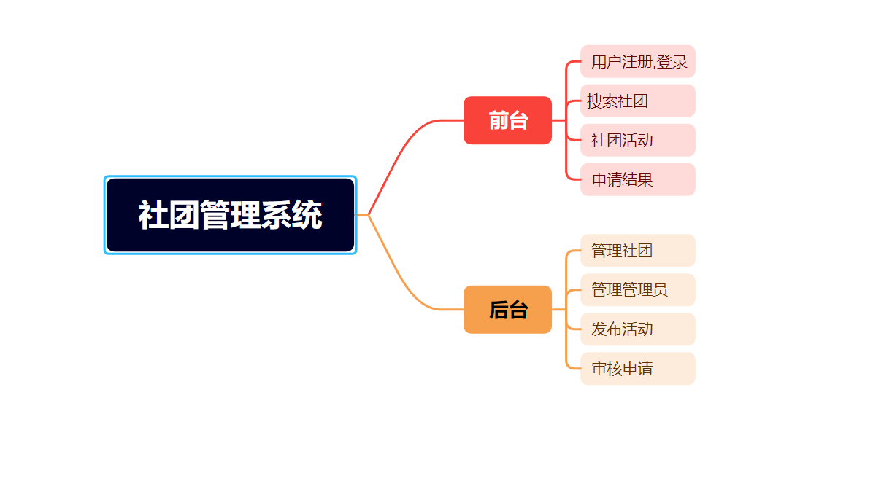
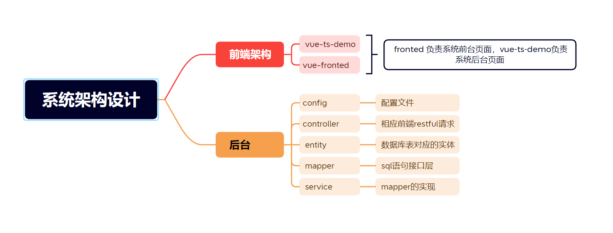
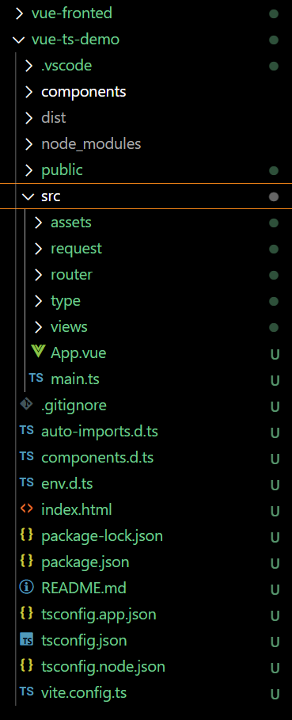
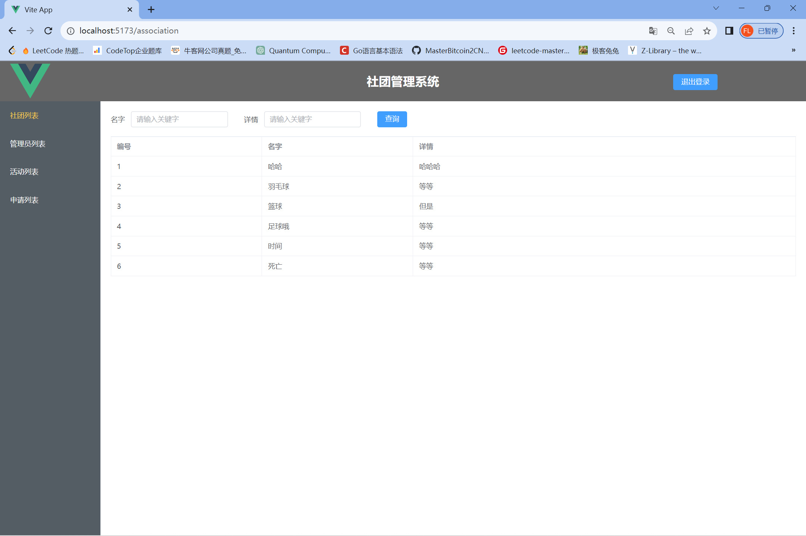
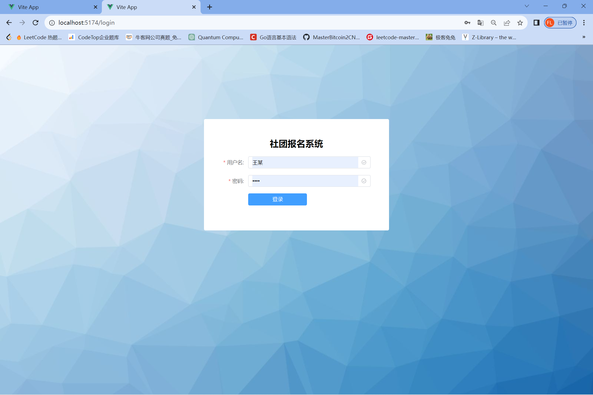

# 社团管理系统

## 1. 介绍

基于前后端分离开发方式，使用`Spring Boot`、`vue`等技术开发社团管理系统。系统功能如下图所示。

## 2. 系统设计

1. 前端使用 `Vue3 `+ `typescript`
2. 后端使用 `Spring Boot` + `mybatis-plus` 

# 3.后端开发介绍

- 模块 mapper,entity,service,采用maybatis-x代码生成器生成
- yml文件配置数据库连接，运行端口等等

# 4. 前端开发介绍

- 采用view组件化开发，提高开发效率

# 5. 系统运行效果

- 后台管理页面

- 前台登录页面

  

  # 6. 前端代码地址
- URL
